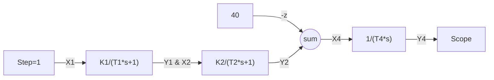
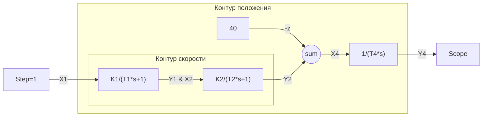
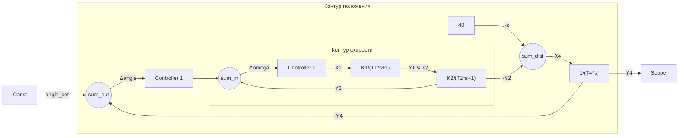
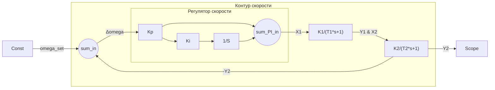
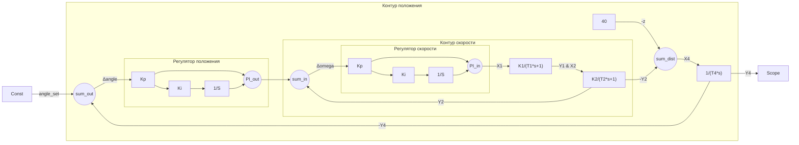
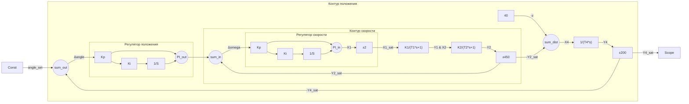
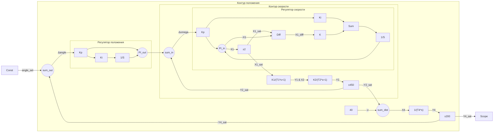

# Введение
Актуальность работы – Необходимость разработки высокоточных систем позиционного регулирования, работающих в условиях возмущений.
Цель работы – Синтез двухконтурной системы управления с настройкой на модульный и симметричный оптимумы.
Задачи – анализ объекта, синтез регуляторов, моделирование, программная реализация.
Объект исследования – Система с двумя апериодическими звеньями, возмущением и интегратором.
Методы исследования – Теория автоматического управления, методы оптимизации, имитационное моделирование.

# 1. Описание объекта регулирования
## 1.1.  Краткое описание объекта регулирования
Объект регулирования представлен на рисунке 1 и представляет собой 2 последовательно соединённых апериодических звена 1-го порядка W1 и W2, а значение, подаваемое на интегратор W4, формируется из выходного значения последнего апериодического звена W2 и возмущения Z. Выходной сигнал интегратора Y4 представляет собой регулируемую координату системы.

**Рисунок 1 – Заданный объект регулирования**
Объект характеризуется следующими передаточными функциями:

$$
\begin{cases}

W_{1}(s) = \frac{K_{1}}{T_{1} \cdot s + 1} \\
W_{2}(s) = \frac{K_{2}}{T_{2} \cdot s + 1} \\
W_{4}(s) = \frac{1}{T_{4} \cdot s} \\

\end{cases}
$$
Параметры объекта занесены в таблицу 1.

**Таблица 1 – Параметры объекта управления**

| Наименование            | Обозначение | Значение |
| ----------------------- | ----------- | -------- |
| Коэффициент усиления №1 | K1          | 4,720    |
| Постоянная времени №1   | T1          | 0,003    |
| Коэффициент усиления №2 | K2          | 12,50    |
| Постоянная времени №2   | T2          | 0,011    |
| Постоянная времени №4   | T4          | 0,188    |
| Возмущение              | Z           | 40       |

В контексте данной работы для наглядности обусловимся, что объект представляет собой электромеханическую систему позиционного регулирования (сервопривод). Первые два звена описывают электромеханическую часть привода, интегратор – преобразование угловой скорости (Y2 - Z) в положение (Y4). Возмущение Z моделирует момент нагрузки, влияющий на угловую скорость выходного вала привода.
## 1.2.  Основное назначение и режимы работы
Разрабатываемая система управления предназначена для прецизионного позиционирования в технологических процессах, требующих высокой точности и динамики, таких как:

- Аддитивное производство (3D-печать):
	- Точное позиционирование экструдера/лазера по осям X, Y, Z;
	- Синхронное движение нескольких осей при построении сложных геометрий;
	- Минимизация вибраций и перерегулирования для улучшения качества поверхности.
- Обработка материалов с ЧПУ:
	- Фрезерные, токарные и лазерные станки;
	- Контурное движение с постоянной скоростью подачи;
	- Высокая повторяемость при серийном производстве.
- Робототехника и автоматизация:
	- Позиционирование манипуляторов в сборочных линиях;
	- Точное наведение рабочего органа в сварочных и покрасочных работах.
Разрабатываемая электромеханическая система должна обеспечивать следующие режимы работы системы:
- Режим стабилизации положения – удержание заданной позиции при действии возмущений (Z)
- Режим слежения – отслеживание изменяющегося задающего сигнала
- Режим позиционирования – перемещение между дискретными точками углового положения.
- Режим работы с переменной нагрузкой – компенсация изменяющегося момента сопротивления
## 1.3.  Анализ характеристик и динамических свойств
Объект управления представляет собой разомкнутую систему третьего порядка с последовательным соединением динамических звеньев и внешним возмущением.
Структурный анализ:
- W₁(s) – апериодическое звено 1-го порядка: представляет собой быстродействующую часть системы (электромагнитные процессы).
- W₂(s) – апериодическое звено 1-го порядка: представляет собой механическую инерционность вала электромеханического преобразователя
- W₄(s) - интегрирующее звено: преобразует угловую скорость в угловое положение вала.
- Z – постоянное возмущение: воздействует на вход интегратора
Математическое описание:
Передаточная функция разомкнутой системы от входа X₁ к выходу Y₄ возможно найти путём преобразования структурной схемы:
$$
W_{раз}(s)=W_{1}(s) \cdot W_{2}(s) \cdot W_{4}(s) = 
\frac{K_1 \cdot K_2}{T_4 \cdot s \cdot (T_1 \cdot s + 1) \cdot (T_2 \cdot s + 1)}
$$
# 2.  Разработка системы управления
## 2.1.  Структурная схема встраиваемой системы управления
Для осуществления контуров регулирования необходима система автоматического управления, которая получая данные с датчиков и органов управления для задания уставных значений, способна в автоматическом режиме осуществлять регулирование переменных состояния системы.

Для питания встраиваемой системы управления необходимо использовать понижающий преобразователь напряжения (обусловимся, что в данной системе номинальное напряжение для обеспечения питания органов управления и измерительных приборов соответствует уровню 5V).

Для описания структуры встраиваемой системы управления составлена схема электрическая – структурная в упрощённом виде, которая представлена на рисунке 2.
**Рисунок 2 – Структурная схема встраиваемой системы**
## 2.2.  Функциональная схема встраиваемой системы управления
Функциональная схема разрабатываемой системы управления показана на рисунке 3. Она отражает состав аппаратных средств и их взаимосвязи для реализации двухконтурной системы позиционирования.

**Состав аппаратных средств:**
1. **Орган управления**:
    - **Инкрементальный энкодер** - используется для навигации в меню, изменения ограничений, задания целевого положения. Вращение энкодера преобразуется в цифровые импульсы, которые микроконтроллер интерпретирует как команды для осуществления навигации в меню и изменения значений задаваемых параметров.
2. **Органы индикации**:
    - **ЖК-дисплей с SPI-интерфейсом** - отображает меню, текущее положение вала, заданное значение, скорость вращения, режим работы и диагностические сообщения.
3. **Измерительные преобразователи**:
    - **Инкрементальный энкодер на валу двигателя** - основной датчик обратной связи. По двум каналам (A, B) определяется направление и угол поворота, а программно обеспечение производит перерасчёт импульсов в угловую скорость и абсолютное угловое положение вала.
4. **Исполнительные устройства**:
    - **Силовой блок управления** - усилитель мощности, преобразующий ШИМ-сигнал от микроконтроллера в напряжение питания двигателя постоянного тока.
    - **Двигатель постоянного тока** - электромеханический преобразователь, осуществляющий преобразование электрической энергию в механическое вращение.
5. **Микроконтроллер STM32F446RET6**:
    - Осуществляет обработку сигналов энкодеров, реализацию алгоритмов регулирования, формирование сигналов управления и индикации.

**Рисунок 2 – Структурная схема встраиваемой системы**
## 2.3.  Таблица сигналов и переменных
Для однозначной идентификации сигналов в аппаратной и программной частях системы управления они были сведены в таблицу 2 сигналов и переменных. Данная таблица служит основой для проектирования схемы соединений, написания программного кода и проведения настройки системы, обеспечивая согласованность между различными компонентами системы. 

**Таблица 2 – Таблица сигналов и переменных системы**

| №                                                  | Наименование                          | Диапазон                                    | Тип данных               | Назначение                                                                       |
| -------------------------------------------------- | ------------------------------------- | ------------------------------------------- | ------------------------ | -------------------------------------------------------------------------------- |
| Входы системы                                      |                                       |                                             |                          |                                                                                  |
| 1                                                  | Значение энкодера управления          | 0 - 65535                                   | uint16_t                 | Настройка системы управления, изменение уставного значения, ограничений          |
| 2                                                  | Состояние кнопки энкодера управления  | 0 - не нажата   1 - нажата            | uint16_t                 | Подтверждение выбора параметра, сохранение настроек, переход между окнами меню   |
| 3                                                  | Значение энкодера обратной связи      | -2147483648 - +2147483647                   | int32_t                  | Определение угловой скорости вала двигателя и его углового положения             |
| Выходы системы                                     |                                       |                                             |                          |                                                                                  |
| 4                                                  | Управляющее значение ШИМ              | 0 - 100%                                    | аналог.,   0-5 [В] | Задание напряжения на двигатель постоянного тока                                 |
| 5                                                  | Сигнал для передачи данных на дисплей | -                                           | -                        | Передача актуальных значений параметров на дисплее по протоколу SPI              |
| Внутренние переменные состояний системы управления |                                       |                                             |                          |                                                                                  |
| 6                                                  | X1                                    | *(от -2  до +2)                       | float                    | Управление на преобразователь  (1-е апериодическое звено 1-го порядка)     |
| 7                                                  | Y1                                    | вещественное число в рамках диапазона float | float                    | Выходное значение преобразователя  (1-е апериодическое звено 1-го порядка) |
| 8                                                  | X2                                    | вещественное число в рамках диапазона float | float                    | Входное значение на ДПТ  (2-е апериодическое звено 1-го порядка)           |
| 9                                                  | Z                                     | константа 40                                | uint16_t                 | Момент нагрузки влияющий на угловую скорость вала ДПТ                            |
| 10                                                 | Y2                                    | *(от -450  до 450)                    | float                    | Входная угловая скорость вала ДПТ  (2-е апериодическое звено 1-го порядка) |
| 11                                                 | X4                                    | *(от -490  до 410)                    | float                    | Входная угловая скорость вала ДПТ с учётом момента сопротивления                 |
| 12                                                 | Y4                                    | *(от -200  до 200)                    | float                    | Угловое положение вала ДПТ                                                       |

\* Для внутренних переменных состояний системы в круглых скобках указаны значения с учётом ограничения
# 3.  Система автоматического управления

## 3.1. Определение контуров регулирования и каналов для организации сигналов обратной связи
Анализ динамических свойств (пункт 1.3) объекта управления, представленного на рисунке 1, показывает, что его структура разделяется на два каскада, а именно:
- Электромеханический каскад (звенья W₁(s) и W₂(s)), преобразующий управляющее напряжение в угловую скорость вала;
- Кинематический каскад (звено W₄(s)), интегрирующий угловую скорость и формирующий выходную координату — угловое положение.

Такая вложенная структура управления является типичной для применения принципа подчинённого регулирования. В соответствии с этим принципом разработана двухконтурная каскадная схема, в которой:

Внутренний контур регулирует угловую скорость (Y2). Его основная задача, это обеспечение быстродействия и подавление возмущений (момента нагрузки Z), действующих на механическую часть привода.

Внешний контур регулирует угловое положение (Y₄). Выходной сигнал его регулятора формирует задание для внутреннего контура по скорости.

Данный подход позволяет разделить общую задачу управления на две более простые, тем самым, улучшить динамические характеристики системы и повысить её робастность к внешним возмущениям.

На рисунке 4 показана структурная схема с выделенными контурами регулирования.

**Рисунок 4 – Выделенные контуры регулирования на схеме**

После добавления обратных связей для обоих контуров схема приобрела вид, представленный на рисунке 5.

**Рисунок 5 – Схема подчинённого регулирования положения вала ДПТ**
## 3.2. Оптимизация контуров регулирования
Настройка регуляторов на стандартные оптимумы (модульный и симметричный) представляет собой инженерный метод синтеза, обеспечивающий гарантированные показатели качества переходного процесса. Данный подход позволяет получить систему с предсказуемыми динамическими характеристиками без необходимости сложных итерационных процедур настройки.
Преимущества настройки на оптимумы:
- Гарантированное быстродействие: время переходного процесса определяется выбранной постоянной времени Tμ;
- Максимальное перерегулирование: для модульного оптимума - не более 4,3%, для симметричного - не более 43%;
- Простота реализации: коэффициенты регуляторов вычисляются по аналитическим формулам исходя из желаемых передаточных функций контуров.

Настройка внешнего контура на симметричный оптимум необходима для достижения астатизма 2-го порядка по задающему воздействию, что обеспечивает нулевую установившуюся ошибку как по положению, так и по скорости.

Общий вид выражений для настройки на оптимумы
$$
\begin{cases}

W_{жел\_раз}^{МО}=\frac{1}{2 \cdot T_{\mu\omega} \cdot s \cdot (T_{\mu\omega} \cdot s + 1)} \\
W_{жел\_замк}^{МО}=\frac{1}{2 \cdot T_{\mu\omega} \cdot s \cdot (T_{\mu\omega} \cdot s + 1) + 1} \\
\\
W_{жел\_раз}^{CО}=\frac{4 \cdot T_{\mu\phi} \cdot s + 1}{8 \cdot T_{\mu\phi}^{2} \cdot s^{2} \cdot (T_{\mu\phi} \cdot s + 1)} \\
W_{жел\_замк}^{CО}=\frac{4 \cdot T_{\mu\phi} \cdot s + 1}{8 \cdot T_{\mu\phi}^{2} \cdot s^{2} \cdot (T_{\mu\phi} \cdot s + 1) + (4 \cdot T_{\mu\phi} \cdot s + 1)} \\

\end{cases}
$$
### 3.2.1. Настройка контура скорости на модульный оптимум
Настройка внутреннего контура скорости выполнена на модульный оптимум (МО), что обеспечивает максимальное быстродействие при ограничении на перерегулирование не более 4,3%.
**Процедура настройки:**
1. Определён объект регулирования - последовательное соединение W₁(s) и W₂(s)
2. Составлена желаемая передаточная функция разомкнутой системы на МО
3. Компенсирована наименьшая постоянная времени T₁ = 0,003 с
4. Получено уравнение ПИ-регулятора
5. Выражены и аналитически рассчитаны коэффициенты ПИ регулятора

$$
\begin{cases}

W_{ОУ_1}= W_{1}(s) \cdot W_{2}(s) = \frac{K_{1} \cdot K_{2}}{(T_{1} \cdot s + 1) \cdot (T_{2} \cdot s + 1)} \\

W_{жел\_раз}^{МО}=W_{ОУ_1} \cdot W_{рег} \\
W_{рег}=\frac{W_{жел\_раз}^{МО}}{W_{ОУ_1}}  \\
\\
T_{\mu\omega} = T_{1} \, -\, наименьшая \, постоянная \, времени \\
\\
W_{рег}=\frac{1}{2 \cdot T_{\mu\omega} \cdot s \cdot (T_{\mu\omega} \cdot s + 1)} \frac{(T_{1} \cdot s + 1) \cdot (T_{2} \cdot s + 1)}{K_{1} \cdot K_{2}} \\

W_{рег}=\frac{1}{2 \cdot K_{1} \cdot K_{2} \cdot T_{\mu\omega}} \cdot \frac{(T_{2} \cdot s + 1)}{s} - ПИ \, регулятор \\
\\
W_{PI} = K_{p} \cdot (1 + \frac{K_{i}}{s}) \, - уравнение \, ПИ \, регулятора \\
\\
K_{p\_\omega} = \frac{T_{2}}{2 \cdot K_{1} \cdot K_{2} \cdot T_{\mu\omega}} \\
K_{i\_\omega} = \frac{1}{T_{2}} \\

\end{cases}
$$

**Ожидаемые показатели качества:**
- Время переходного процесса: t_п ≈ 4,7·T_μω = 0,0141 с
- Перерегулирование: σ ≤ 4,3%
### 3.2.2. Настройка контура положения на симметричный оптимум
Внешний контур положения настроен на симметричный оптимум (СО), что позволяет достичь астатизма 2-го порядка и обеспечить высокую точность позиционирования.
**Обоснование выбора СО:**
- Необходим астатизм 2-го порядка по задающему воздействию
- Объект регулирования содержит интегрирующее звено
**Процедура настройки:**
1. Определён объект регулирования - упрощенная модель внутреннего контура и интегратор
2. Составлена желаемая передаточная функция разомкнутой системы СО
3. Компенсирована удвоенная наименьшая постоянная времени
4. Получено уравнение ПИ-регулятора
5. Выражены и аналитически рассчитаны коэффициенты ПИ регулятора

$$
\begin{cases}

W_{жел\_замк}^{МО} = \frac{1}{2 \cdot T_{\mu\omega} \cdot s \cdot (T_{\mu\omega} \cdot s + 1) + 1} \\

W_{ОУ_2} = W_{жел\_замк}^{упрощ} \cdot W_{4}(s) = \frac{1}{s \cdot 2 \cdot T_{\mu\omega} + 1} \cdot \frac{1}{T_{4} \cdot s} \\

W_{жел\_раз}^{СО}=W_{ОУ_2} \cdot W_{рег} \\
W_{рег}=\frac{W_{жел\_раз}^{CО}}{W_{ОУ_2}}  \\
\\
T_{\mu\phi} = 2 \cdot T_{\mu\omega} \, - в \, симметричном \, оптимуме \\
\\
W_{рег}=\frac{4 \cdot T_{\mu\phi} \cdot s + 1}{8 \cdot T_{\mu\phi}^{2} \cdot s^{2} \cdot (T_{\mu\phi} \cdot s + 1)} \cdot \frac{s \cdot 2 \cdot T_{\mu\omega} + 1}{1}
\cdot  \frac{T_{4} \cdot s}{1}\\

W_{рег}=\frac{T_{4}}{8 \cdot T_{\mu\phi}^{2}}
\cdot
\frac{(4 \cdot T_{\mu\phi} \cdot s + 1)}{s}  - ПИ \, регулятор \\
\\
W_{PI} = K_{p} \cdot (1 + \frac{K_{i}}{s}) \, - уравнение \, ПИ \, регулятора \\
\\
K_{p\_\phi} = \frac{1}{4 \cdot T_{\mu\phi}} \\
K_{i\_\phi} = \frac{T_{4}}{2 \cdot T_{\mu\phi}} \\

\end{cases}
$$

**Ожидаемые показатели качества:**
- Астатизм 2-го порядка: нулевая ошибка по положению и скорости
- Перерегулирование: σ ≈ 43% (допустимо для контура положения)
- Время переходного процесса: t_п ≈ 16,5·T_μφ = 0,099 с
## 3.3. Имитационная модель линеаризованной системы управления

Для верификации разработанной системы управления и анализа её динамических характеристик построена имитационная модель линеаризованной системы в программном пакете для математического моделирования.

Верификация настройки контура скорости представлена на рисунках 6 и 7.

**Рисунок 6 – Схема контура регулирования скорости**

**Рисунок 7 – Верификация показателей качества контура скорости (уставка = 1)**

Верификация настройки контура положения представлена на рисунках 8 - 10.

**Рисунок 8 – Схема подчинённого регулирования положения вала ДПТ**

**Рисунок 9 – Верификация показателей качества контура положения на ступенчатое воздействие (уставка = 10)**

**Рисунок 10 – Верификация показателей качества контура положения на линейно растущее воздействие (tg наклона = 1)**

Результаты моделирования подтвердили расчетные показатели качества и продемонстрировали эффективность применения принципа подчиненного регулирования с настройкой на стандартные оптимумы, однако из-за упрощения в виде замены контура скорости на апериодическое звено 1-го порядка увеличилось перерегулирование и время переходного процесса в системе относительно желаемых показателей качества.

## 3.4. Корректирующие цепи для соответствия дополнительным требованиям

Учитывая заданные в таблице 2 ограничения переменных состояния системы, структурная схема, представленная на рисунке 8, была дополнена соответствующими элементами.

**Рисунок 11 – Схема подчинённого регулирования с ограничениями**

Модифицированная схема с учётом ограничений показана на рисунке 11.
Введение ограничений на переменные состояния позволяет реализовать защиту системы, предотвращая подачу чрезмерного напряжения на управляющие цепи, ограничивая максимальную угловую скорость вращения вала, а также задавая допустимые пределы для углового перемещения вала двигателя постоянного тока в обоих направлениях. Однако, такой подход способен значительно ухудшить динамические характеристики системы. Для того, чтобы убедиться в этом было проведено моделирование при различных значениях задания угла вала ДПТ. Результаты моделирования показаны на рисунках 12 и 13.

**Рисунок 12 – Переходные процессы по положению при различном задании**

**Рисунок 13 – Переходные процессы переменной состояния X1 при различном задании**

Исходя из результатов моделирования можно сделать вывод, что значения задания более 3 град. приводят к насыщению переменной состояния X1. При значении задания 9 система выходит из равновесия из-за интегрального насыщения на ПИ регуляторе. Ввиду нестабильности переходного процесса при значительном изменении уставки относительно предыдущего её значения, необходимо иметь защиту по интегральному насыщению (Anti-Windup) в ПИ-регуляторах.

В качестве защиты от насыщения решено использовать метод (Back-Calculation). Структурная схема ПИ-регулятора с методом компенсации (Back-Calculation) представлена на рисунке 14.

**Рисунок 14 – Структурная схема ПИ регулятора с компенсацией интегрального насыщения**

Эмпирическим методом подобран коэффициент gain равный 5000 при частоте дискретизации (10 кГц). Именно с таким коэффициентом получилось добиться наилучших переходных характеристик. Результаты моделирования с компенсацией насыщения с коэффициентом усиления 5000 представлены на рисунке 15. Исходя из полученных характеристик можно сделать вывод, что метод компенсации работает, однако при сильном изменении задания по угловому положению относительно предыдущего значения всё равно имеются колебания, однако теперь переходные процессы устойчивы. Для решения проблемы резкого изменения задания предлагается установить фильтр в виде апериодического звена 1-го порядка, для плавного изменения уставного значения и соответственно избавления от колебательных процессов при сильном изменении задания.

**Рисунок 15 – Переходные процессы переменной состояния X1 при различном задании с компенсацией интегрального насыщения**

**Рисунок 16 – Переходные процессы переменной состояния X1 при различном задании с компенсацией интегрального насыщения и фильтром на задании**

Исходя из результатов моделирования на рисунке 16 с применением фильтра на входе с постоянной времени равной 0,1 удалось добиться переходных процессов с меньшим перерегулированием и колебательностью.

## 3.5. Программная реализация разработанной системы управления и объекта регулирования
Для последующей реализации системы на микроконтроллере и в среде математического моделирования необходимо выполнить перевод непрерывных передаточных функций в дискретный вид. Это преобразование осуществляется с использованием метода Эйлера 1-го порядка, что позволяет получить разностные уравнения, пригодные для реализации в цифровых системах управления. Дискретизация выполняется с частотой 300 Гц (ν = 0,3·10³ Гц), что соответствует шагу дискретизации Δt = 0,0034 с. Полученные дискретные модели будут использованы как для построения машины состояний в среде моделирования, так и для реализации на микроконтроллере.
Передаточная функция в общем виде выглядит следующим образом
$$
W(s) = \frac{Y(s)}{X(s)} = \frac{y(t)}{x(t)}
$$
Передаточные функции объекта управления и регуляторов
$$
\begin{cases}

W_{1}(s) = \frac{K_{1}}{T_{1} \cdot s + 1} \\
W_{2}(s) = \frac{K_{2}}{T_{2} \cdot s + 1} \\
W_{4}(s) = \frac{1}{T_{4} \cdot s} \\
W_{PI}(s) = K_{p} \cdot (1 + K_{i} \cdot \frac{1}{s}) \\

\end{cases}
$$
### 3.5.1. Перевод интегрирующего звена в дискретный вид
Интегрирующее звено описывает преобразование скорости в положение. Применяя метод Эйлера, получаем разностное уравнение, связывающее текущее значение выхода y[i] с предыдущим y[i-1] и текущим входом x[i]. Далее приведён ход преобразований для получения итогового выражения в дискретном виде.
$$
\begin{cases}

\frac{y(t)}{x(t)} = \frac{K}{T \cdot s} \\

y(t) \cdot T \cdot s = x(t) \cdot K \\
\\
T \cdot \frac{y[i] - y[i-1]}{\Delta t} = x[i] \cdot K \\

y[i] \cdot T - y[i-1] \cdot T = x[i] \cdot K \cdot \Delta t \\

y[i] \cdot T = y[i-1] \cdot T + x[i] \cdot K \cdot \Delta t \\

y[i] = y[i-1] + x[i] \cdot \frac{K \cdot \Delta t}{T} \\
\\
k = \frac{K \cdot \Delta t}{T} \\
\\
y[i] = y[i-1] + x[i] \cdot k \\
\end{cases}
$$
### 3.5.2. Перевод апериодического звена в дискретный вид
Апериодические звенья W₁(s) и W₂(s), описывающие динамику электромеханической системы, также преобразуются в дискретный вид при помощи метода Эйлера. Далее приведён ход преобразований для получения итогового выражения в дискретном виде.
$$
\begin{cases}

\frac{y(t)}{x(t)} = \frac{K}{T \cdot s+1} \\

y(t) \cdot (T \cdot s + 1) = K \cdot x(t) \\

T \cdot y(t) \cdot s + y(t) = K \cdot x(t) \\

\\

T \cdot \frac{y[i] - y[i-1]}{\Delta t} + y[i] = K \cdot x[i] \\

y[i] \cdot T - y[i-1] \cdot T + y[i] \cdot \Delta t = x[i] \cdot K \cdot \Delta t \\

y[i] \cdot (T + \Delta t) = y[i-1] \cdot T + x[i] \cdot K \cdot \Delta t \\

\\

y[i] = y[i-1] \cdot \frac{T}{(T + \Delta t)} + x[i] \cdot \frac{K \cdot \Delta t}{(T + \Delta t)} \\

\\
k_{1} = \frac{T}{T + \Delta t} \\
k_{2} = \frac{K \cdot \Delta t}{T + \Delta t} \\

\\

y[i] = y[i-1] \cdot k_{1} + x[i] \cdot k_{2} \\

\end{cases}
$$
### 3.5.3. Перевод ПИ регулятора в дискретный вид
ПИ-регулятор, используемый в обоих контурах системы, разделяется на пропорциональную и интегральную составляющие. Интегральная часть преобразуется аналогично интегрирующему звену, а пропорциональная часть остаётся без изменений. Результирующий алгоритм вычисляет выход как сумму накопленного интеграла и пропорциональной составляющей. Далее приведён ход преобразований для получения итогового выражения в дискретном виде.
$$
\begin{cases}

\frac{y(t)}{x(t)} = K_{p} \cdot (1 + K_{i} \cdot \frac{1}{s}) \\
\\
y(t) = x(t) \cdot K_{p} + x(t) \cdot \frac{K_{p} \cdot K_{i}}{s} \\
y(t) = out_I + out_P \\
out_P = x(t) \cdot K_{p} \\
\\
out_I = \frac{x(t) \cdot K_{p} \cdot K_{i}}{s} \\
out_I \cdot s = x(t) \cdot K_{p} \cdot K_{i} \\
\\
\frac{out_I[i] - out_I[i-1]}{\Delta t} = x[i] \cdot K_{p} \cdot K_{i} \\
out_I[i] = out_I[i-1] + x[i] \cdot K_{p} \cdot K_{i} \cdot \Delta t \\
\\
k = K_{p} \cdot K_{i} \cdot \Delta t \\
out_I[i] = out_I[i-1] + x[i] \cdot k \\
out_P[i] = x[i] \cdot K_{p} \\
\\
y[i] = out_I[i] + out_P[i] \\

\end{cases}
$$
Расчёт коэффициентов ПИ регулятора на модульный и симметричный оптимум приведён в разделе 3.2.
### 3.5.4. Перевод ПИ регулятора c защитой от интегрального насыщения в дискретный вид
Для реализации защиты от интегрального насыщения (anti-windup) методом обратного расчёта (back-calculation) необходимо модифицировать дискретную модель ПИ-регулятора. В отличие от простого ПИ-регулятора, здесь добавляется корректирующая составляющая out_C, которая зависит от разности между ограниченным и неограниченным выходом регулятора (Δy_sat). Эта дополнительная обратная связь позволяет предотвратить накопление ошибки в интеграторе при насыщении управляющего воздействия. Далее приведён ход преобразований для получения итогового выражения в дискретном виде.
$$
\begin{cases}

y(t) = x(t) \cdot K_{p} + x(t) \cdot \frac{K_{p} \cdot K_{i}}{s} + \Delta y_{sat}(t) \cdot \frac{k_{comp}}{s} \\
y(t) = out_I + out_P + out_C \\
\\
out_I \, и \, out_P \; были \, выведены \, ранее \\
\\
out_C = \Delta y_{sat}(t) \cdot \frac{k_{comp}}{s} \\
out_C \cdot s = \Delta y_{sat}(t) \cdot k_{comp} \\
\\
\frac{out_C[i] - out_C[i - 1]}{\Delta t} = \Delta y_{sat}[i] \cdot k_{comp} \\
out_C[i] - out_C[i - 1] = \Delta y_{sat}[i] \cdot k_{comp} \cdot \Delta t \\
out_C[i] = out_C[i - 1] + \Delta y_{sat}[i] \cdot k_{comp} \cdot \Delta t \\
\\
k = K_{p} \cdot K_{i} \cdot \Delta t \\
k_{sat} = k_{comp} \cdot \Delta t \\
out_P[i] = x[i] \cdot K_{p} \\
out_I[i] = out_I[i-1] + x[i] \cdot k \\
out_C[i] = out_C[i - 1] + \Delta y_{sat}[i] \cdot k_{comp} \cdot \Delta t \\
\\
y[i] = out_I[i] + out_P[i] + out_C[i] \\

\end{cases}
$$
## 3.6. Реализация системы управления с ограничениями в контуре
После перевода всех элементов системы в дискретный вид была выполнена программная реализация в среде математического моделирования. Для каждого дискретного звена создан соответствующий блок с реализацией на языке C, что позволяет как проводить моделирование в среде разработки, так и напрямую использовать полученный код на микроконтроллере. Особое внимание уделено использованию типа данных single аналогичного типу данных float на микроконтроллере, а также реализации ограничений переменных состояния и защите от интегрального насыщения, что обеспечивает устойчивость системы при работе в реальных условиях.
Итоговый вид структурной схемы с блоками, реализованными в дискретном виде приведён на рисунке 17.

**Рисунок 17 – Структурная схема системы управления в дискретном виде**
# 4. Элементы логического контроля
## 4.1. Машина состояний системы управления

Разработанная машина контроля состояния системы реализует упрощенную, логику контроля, состоящую из трех основных состояний: OFF, RUN, и FAULT. Данная структура обеспечивает четкое разделение режимов работы и безопасные переходы между ними. Разработанная машина контроля состояния представлена на рисунке 20.

**Рисунок 20 – Вид машины контроля состояний**

Как было сказано, система имеет 3 основных состояния – (OFF, RUN, FAULT), и условия перехода между ними. Для наглядного представления переходов была составлена таблица 3.

Таблица 3 – Условия переходов между осостяниями

|   |   |   |
|---|---|---|
|Состояние нач.|Условие|Состояние конеч.|
|OFF/RUN|Инверсное отношение  (Разрешена работа системы/  Запрещена работа системы)|RUN/OFF|
|RUN|Уставное значение угла превышает предельные разрешённые значения, Разница значений на одном из элементов насыщения держится более N секунд)|FAULT|
|FAULT|Запрещена работа системы|OFF|

Таким образом, при попадании в состояние ошибки, единственным выходом из него будет перезагрузка системы. Это связано с тем, что техническому специалисту будет необходимо сначала проверить систему, перед её перезагрузкой во избежании
Общий вид схемы с встроенной машиной контроля состояния выглядит следующим образом:

**Рисунок 21 – Вид встроенной машины контроля состояний**  
**в систему управления**
## 4.2. Защитные функции
Для проверки работоспособности системы было подано ступенчатое воздействие с уставным значением 200 градусов по положению, что должно привести к накоплению интегральной составляющей на ПИ-регуляторе положения и отсутствию возможности её уменьшения ввиду насыщения выходного значения положения. Это должно привести к возникновению значительной разницы на блоке насыщения перед блоком силового преобразователя и переходу в состояние ошибки после отсчёта 2 сек.
Результаты тестирования защитных функций на ступенчатое воздействие приведены на рисунке 22.

**а –  График переходного процесса на резкое ступенчатое воздействие;**  
**б – График переходов между состояниями системы;**  
**в – График выхода ПИ-регулятора положения**
**Рисунок 23 – Результаты тестирования защитных функций**

Как видно из графиков, действительно, в ПИ-регуляторе положения происходит интегральное насыщение, что приводит в конечном итоге к значительному увеличению сигнала на входе в блок насыщения при X1, что приводит к вызову ошибки системы.

# 5. Программные алгоритмы для микроконтроллера
Для реализации разработанной системы управления на микроконтроллере STM32F446RET6 необходимо выполнить настройку портов и пинов для корректной работы периферии, организовать временные интервалы и реализовать алгоритмы управления в прерываниях. Ключевыми задачами являются: настройка таймеров для генерации прерываний с частотой 300 Гц, конфигурация ШИМ-выходов для генерирования управляющих сигналов, настройка интерфейсов для подключения энкодеров для считывания обратной связи, а также организация SPI-интерфейса для работы с дисплеем.
Учитывая необходимость провести валидацию разработанной системы управления на микроконтроллере, программный код будет разрабатываться только для системы управления, а для проверки корректности системы, будет проведено имитационное моделирование системы в дискретном виде на том же микроконтроллере. Разработка ПО для взаимодействия с дисплеем и органами управления будет избыточна и не будет приведена в данной работе.
## 5.1. Распределение сигналов на внешних портах микроконтроллера
Распределение сигналов по выводам микроконтроллера является первым этапом проектирования встраиваемой системы управления. Необходимо выделить пины для:
* входов энкодеров (таймеры в режиме энкодера),
* ШИМ-выходов (таймеры в режиме ШИМ),
* SPI-интерфейса (для дисплея),
* резервных входов/выходов для реализации дополнительных функций и отладки.
Используемые выводы микроконтроллера приведены на рисунке 24, а также сведена в текстовом формате в таблицу 4.

**Рисунок 24 – Используемые выводы микроконтроллера**
**Таблица 4 – Сводная таблица используемых выводов микроконтроллера**

| Вывод Порт/номер вывода | Назначение                                           |
| ----------------------- | ---------------------------------------------------- |
| PA0                     | Выводы для подключения энкодера №1 управления     |
| PA1                     | Выводы для подключения энкодера №1 управления     |
| PA5                     | SPI интерфейс для взаимодействия с ЖК дисплеем    |
| PB5                     | SPI интерфейс для взаимодействия с ЖК дисплеем    |
| PA6                     | Выводы для подключения энкодера №2 обратной связи |
| PA7                     | Выводы для подключения энкодера №2 обратной связи |
| PB6                     | ШИМ вывод для управления ДПТ                         |
| PA13                    | Выводы для отладки по Serial Wire                    |
| PA14                    | Выводы для отладки по Serial Wire                    |

## 5.2. Перенос на микроконтроллер программных алгоритмов разработанной встраиваемой системы управления и объекта регулирования
Пользуясь разработанными ранее блоками с дискретным расчётом значений был произведён быстрый перенос программных алгоритмов для расчёта всех блоков системы. Программный код для реализации системы размещён на Github по ссылке: [https://github.com/Georgius03/VS_kurs_mag](https://github.com/Georgius03/VS_kurs_mag)

Или по QR коду представленному на рисунке 25 ниже.

**Рисунок 25 – QR код для перехода на репозиторий с кодом**

## 5.3. Экспериментальные исследования алгоритмов управления разработанной встраиваемой системы на микроконтроллере
Для 3 различных типов задающего сигнала (резкое ступенчатое задание, фильтр апериодического звена 1-го порядка и линейно возрастающее задание) было проведено тестирование на микроконтроллере. Графики переходных процессов с наложением 3-х кривых (непрерывной системы, дискретной системы и значений с микроконтроллера) приведены на рисунках 26 - 28. Численные результаты занесены в таблицу 5.

**Рисунок 26 – Сравнение результатов при ступенчатом**  
**задающем воздействии**

**Рисунок 27 – Сравнение результатов при фильтрованном ступенчатом**
**задающем воздействии**

**Рисунок 28 – Сравнение результатов при линейно-возрастающем**  
**задающем воздействии**

**Таблица 5 – Сводная таблица результатов моделирования и численного расчёта**

| STEP                                                               |           |
| ------------------------------------------------------------------ | --------- |
| RMSE между дискретным видом из Matlab и данными с микроконтроллера | 19.049533 |
| Максимальная ошибка                                                | 71.357996 |
| FILTER                                                             |           |
| RMSE между дискретным видом из Matlab и данными с микроконтроллера | 9.449581  |
| Максимальная ошибка                                                | 50.431648 |
| LINEAR                                                             |           |
| RMSE между дискретным видом из Matlab и данными с микроконтроллера | 2.707345  |
| Максимальная ошибка                                                | 13.349102 |

Исходя из полученных графиков и численных результатов можно сделать вывод, что разработанные алгоритмы работоспособны, однако учитывая нюансы расчёта и дискретизации имеется расхождение в переходных процессах. На графиках видно, что ввиду низкой частоты расчёта ПИ-регуляторов (300 Гц) происходит колебательный процесс при моделировании. Однако при расчёте переходных процессов на микроконтроллере таких колебаний не происходит. При моделировании системы управления на частоте 1000 Гц, таких колебаний не было обнаружено.
