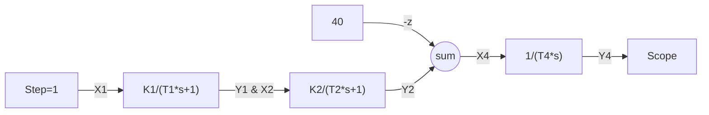

# VS_kurs_mag

```mermaid
	flowchart LR
		
		Step["Step=1"]
		W1["K1/(T1*s+1)"]
		W2["K2/(T2*s+1)"]
		Z[40]
		Sum(("sum"))
		W4["1/(T4*s)"]
		Scope["Scope"]
		
		Step --> |X1| W1
		W1 --> |Y1 & X2| W2
		Z --> |"-z"|Sum
		W2 --> |Y2| Sum
		Sum --> |X4| W4
		W4 --> |Y4| Scope
```
